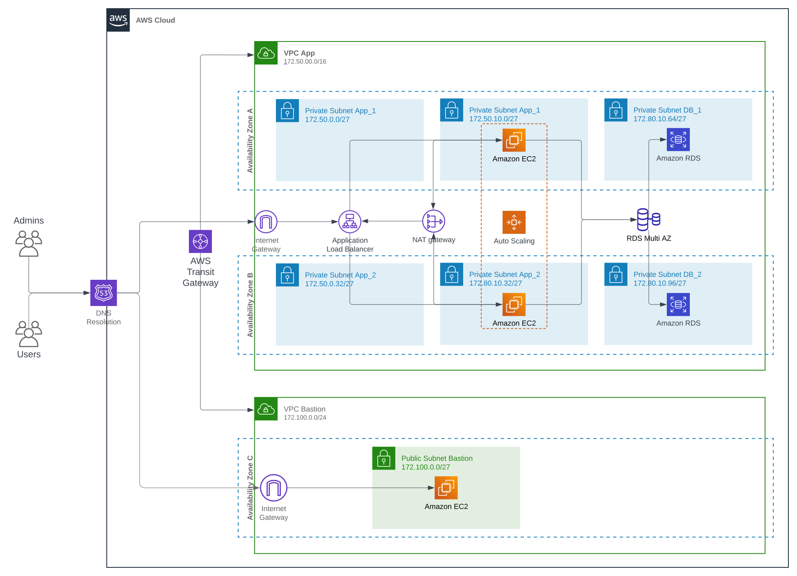

# terraform-aws-asg-rds

WebApp internet facing on AWS EC2 Scaling group and RDS Aurora cluster.


## Overview

The purpose of this project is sharing a simple solution for who wants to learn, practice, or try different solutions to improve their infrastructures on cloud.
In addition, it can be taken to discuss and improve it, in other words, for whom that want to collaborate, share experiences and knowledge.

There are a couple of different enhances that can be implemented on this, such as using Terraform modules to simplify the code and making a reusable coding, which will be cover in other repositories.

> ⚠️ **Warning:**
> 
> Do NOT use it to deploy workloads in production environments. This is a PoC, and it is NOT under the best practices related to security.


## Table of Contents

1. [Solution diagram](#solution_diagram)
2. [Purpose](#purpose)
3. [Use cases](#use_cases)
4. [Resources](#resources)
5. [Contributing](#contributing)
6. [Author](#author)


### Solution diagram




## Use cases

It can be taken for the following scenarios:
- Learning and practicing infrastructure as code and cloud services using Terraform and AWS.
- As proof of concept to think basic webapps and databases.
- As testings on isolate environments, such as sandbox environments.


## Usage

### Prerequisites

1. Git SCM
    - Install on Windows: https://www.git-scm.com/download/win
    - Install on Linux: https://www.git-scm.com/download/linux
    - Install on MacO: Shttps://www.git-scm.com/download/mac

2. Terraform: https://developer.hashicorp.com/terraform/install 

3. AWS Account: https://aws.amazon.com/

4. AWS Access and Secret Key: https://docs.aws.amazon.com/IAM/latest/UserGuide/id_credentials_access-keys.html#Using_CreateAccessKey


### Steps

1. Set AWS access and secret key as environment variables

Windows
```bash
set AWS_ACCESS_KEY_ID=YOUR_ACCESS_KEY_ID
set AWS_SECRET_ACCESS_KEY=YOUR_SECRET_ACCESS_KEY
```

Linux
```bash
export AWS_ACCESS_KEY_ID="YOUR_ACCESS_KEY_ID"
export AWS_SECRET_ACCESS_KEY="YOUR_SECRET_ACCESS_KEY"
```

2. Clone the repository
```bash
git clone https://github.com/timossileandro/terraform-aws-asg-rds.git
```

3. Change directory
```bash
cd terraform-aws-asg-rds
```

4. Customise
    - variables.tf: change default values as needed.
    - locals.tf: change, add or remove values as needed.
    - check and modify configuration parameters in each resource as needed. 

5. Initialise terraform
```bash
terraform init
```

6. Validate terraform code
```bash
terraform validate
```

7. Run terraform plan and check it
```bash
terraform plan
```

8. Run terraform apply
```bash
terraform apply
```

⚠️ (Optional) If you are learning, practicing or just doing some testing
7. Do not forget to destroy the infrastructure to avoid being charge by AWS
```bash
terraform destroy
```


## Resources

| Name | Type |
|----------|----------|
[aws_launch_template](https://registry.terraform.io/providers/hashicorp/aws/latest/docs/resources/launch_template) | resource |
[aws_autoscaling_group](https://registry.terraform.io/providers/hashicorp/aws/latest/docs/resources/autoscaling_group) | resource |
[aws_kms_key](https://registry.terraform.io/providers/hashicorp/aws/latest/docs/resources/kms_key) | resource |
[aws_kms_key_policy](https://registry.terraform.io/providers/hashicorp/aws/latest/docs/resources/kms_key_policy) | resource |
[aws_instance](https://registry.terraform.io/providers/hashicorp/aws/latest/docs/resources/instance) | resource |
[aws_iam_role](https://registry.terraform.io/providers/hashicorp/aws/latest/docs/resources/iam_role) | resource |
[aws_iam_role_policy_attachment](https://registry.terraform.io/providers/hashicorp/aws/latest/docs/resources/iam_role_policy_attachment) | resource |
[aws_iam_instance_profile](https://registry.terraform.io/providers/hashicorp/aws/latest/docs/resources/iam_instance_profile) | resource |
[aws_rds_cluster](https://registry.terraform.io/providers/hashicorp/aws/latest/docs/resources/rds_cluster) | resource |
[aws_rds_cluster_instance](https://registry.terraform.io/providers/hashicorp/aws/latest/docs/resources/rds_cluster_instance) | resource |
[aws_internet_gateway](https://registry.terraform.io/providers/hashicorp/aws/latest/docs/resources/internet_gateway) | resource |
[aws_route](https://registry.terraform.io/providers/hashicorp/aws/latest/docs/resources/route) | resource |
[aws_route_table](https://registry.terraform.io/providers/hashicorp/aws/latest/docs/resources/route_table) | resource |
[aws_route_table_association](https://registry.terraform.io/providers/hashicorp/aws/latest/docs/resources/route_table_association) | resource |
[aws_lb](https://registry.terraform.io/providers/hashicorp/aws/latest/docs/resources/lb) | resource |
[aws_lb_target_group](https://registry.terraform.io/providers/hashicorp/aws/latest/docs/resources/lb_target_group) | resource |
[aws_lb_listener](https://registry.terraform.io/providers/hashicorp/aws/latest/docs/resources/lb_listener) | resource |
[aws_eip](https://registry.terraform.io/providers/hashicorp/aws/latest/docs/resources/eip) | resource |
[aws_nat_gateway](https://registry.terraform.io/providers/hashicorp/aws/latest/docs/resources/nat_gateway) | resource |
[aws_security_group](https://registry.terraform.io/providers/hashicorp/aws/latest/docs/resources/security_group) | resource |
[aws_vpc_security_group_ingress_rule](https://registry.terraform.io/providers/hashicorp/aws/latest/docs/resources/vpc_security_group_ingress_rule) | resource |
[aws_db_subnet_group](https://registry.terraform.io/providers/hashicorp/aws/latest/docs/resources/db_subnet_group) | resource |
[aws_vpc](https://registry.terraform.io/providers/hashicorp/aws/latest/docs/resources/vpc) | resource |
[aws_subnet](https://registry.terraform.io/providers/hashicorp/aws/latest/docs/resources/subnet) | resource |
[aws_caller_identity](https://registry.terraform.io/providers/hashicorp/aws/latest/docs/data-sources/caller_identity) | data |
[aws_ami](https://registry.terraform.io/providers/hashicorp/aws/latest/docs/data-sources/ami) | data |
[aws_route_table](https://registry.terraform.io/providers/hashicorp/aws/latest/docs/data-sources/route_table) | data |


## Contributing

You are welcome to contribute! If you are interested in discussing or giving your point of view please reach me out on LinkedIn 😃


## Author

- **Leandro Timossi** - [leandrotimossi](https://github.com/timossileandro)


